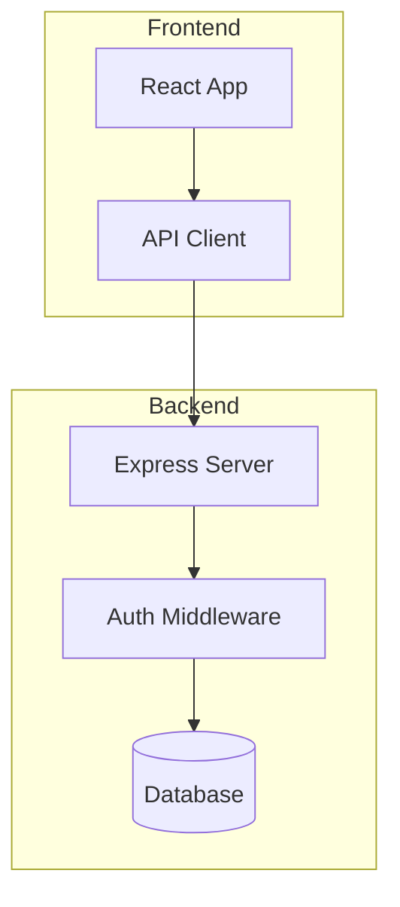

# Diagrams for OpenCode — Концепция и план реализации

## Концепция

### Проблема

В работе с кодом и проектами сложно объяснять и понимать структуру только текстом. Агент и пользователь нуждаются в **визуальном канале коммуникации** — графах, блок-схемах, потоках, картах.

### Решение

**Универсальный diagram editor** для opencode с двусторонней синхронизацией:

- **Агент → Пользователь**: генерирует диаграммы для визуального объяснения
- **Пользователь → Агент**: рисует схемы для объяснения того, что хочет получить
- **Хранение**: диаграммы как файлы `.mmd` (Mermaid) в проекте — version-control friendly

### Области применения (general-purpose)

Редактор **не привязан к одной домене**. Поддерживает любые визуальные структуры:

| Домен | Тип диаграммы | Пример использования |
|-------|--------------|---------------------|
| **ПО** | flowchart, sequence, class, state | Архитектура, API flows, UML |
| **Electronics** | block diagram, schematic | Схемы, PCB, embedded |
| **Data** | ER, graph, mindmap | DB schemas, knowledge graphs |
| **DevOps** | flowchart, C4 | Инфра, деплой, microservices |
| **Документация** | mindmap, flowchart | Структура docs, ADR |
| **Обучение** | mindmap, sequence, flowchart | Объяснение концепций |
| **Планирование** | Gantt, mindmap | Таймлайны, задачи |
| **Любое другое** | graph, custom | Всё что можно представить как граф/схему |

### Целевой UX

```
┌─────────────────────────────────────────────────────┐
│ [Chat]  [Diagram]  [Editor]         ← toggle tabs   │
├─────────────────────────────────────────────────────┤
│                                                     │
│  Chat Panel          │  Diagram Panel               │
│                      │  ┌─────────────────────────┐ │
│  user: покажи        │  │                         │ │
│  архитектуру         │  │   Mermaid rendered as    │ │
│                      │  │   interactive blocks     │ │
│  agent:              │  │   (React Flow canvas)    │ │
│  [создаёт            │  │                         │ │
│   диаграмму]         │  │   [ drag & drop ]        │ │
│                      │  │   [ zoom / pan ]         │ │
│                      │  │   [ node details ]       │ │
│                      │  └─────────────────────────┘ │
│                      │                              │
│                      │  Editor (code view):          │
│                      │  ┌─────────────────────────┐ │
│                      │  │ graph TD                │ │
│                      │  │   A[Frontend] --> B[API] │ │
│                      │  │   B --> C[(DB)]          │ │
│                      │  └─────────────────────────┘ │
└─────────────────────────────────────────────────────┘
```

### Ключевые кейсы

**ПО и архитектура:**
1. **Анализ архитектуры**: агент сканирует проект → строит diagram зависимостей модулей
2. **Объяснение потоков**: "Покажи путь запроса от клиента до БД" → sequence diagram
3. **DB схемы**: ER-диаграммы из миграций/моделей
4. **State machines**: визуализация состояний приложения
5. **API flows**: взаимодействие микросервисов

**Планирование и документация:**
6. **Планирование**: пользователь рисует схему новой фичи → агент реализует по ней
7. **Mind maps**: структура проекта, brainstorm, ментальные карты
8. **Документирование**: диаграммы в README, docs, ADR
9. **C4 architecture**: системная архитектура на разных уровнях

**Электроника (расширение):**
10. **Block diagrams**: схемы электронных устройств
11. **PCB planning**: расположение компонентов
12. **Embedded**: interaction между MCU и периферией

**Универсальное:**
13. **Любой граф**: зависимости, связи, потоки — всё что можно представить как nodes + edges
14. **Brainstorm**: визуальное обсуждение идей с агентом
15. **Обучение**: объяснение сложных концепций через визуал

---

## Долгосрочная визия: Multi-Agent Electronics Design

### Концепция

Диаграммы/графы — это фундамент для **multi-agent системы проектирования электроники**. Граф становится не документацией, а **рабочей структурой проекта** (Work Breakdown Structure).

### Как это работает

```
Человек: "Нужно сделать контроллер мотора с ШИМ и энкодером"
                    │
                    ▼
    ┌──── Architect Agent ────┐
    │  Строит граф-диаграмму: │
    │                         │
    │  [MCU] ──SPI── [Driver] │
    │    │              │     │
    │   I2C           [Motor] │
    │    │              │     │
    │  [Encoder]    [Supply]  │
    └─────────────────────────┘
                    │
                    ▼
         Обсуждение с человеком:
    "Какой MCU? Какой драйвер? Напряжение?"
                    │
                    ▼
    Финальный граф с контрактами интерфейсов:
    ┌─────────────────────────────────────────┐
    │  [STM32G4] ──SPI:10MHz── [DRV8313]     │
    │      │                      │           │
    │   I2C:400kHz              PWM:20kHz     │
    │      │                      │           │
    │  [AS5047]              [3x BLDC, 24V]  │
    └─────────────────────────────────────────┘
                    │
                    ▼
    Каждый узел графа → задача для агента:
    ├── firmware-agent: "Драйвер DRV8313 по SPI для STM32G4"
    ├── schematic-agent: "Схема питания 24V→5V→3.3V"
    ├── pcb-agent: "Разводка платы контроллера"
    ├── encoder-agent: "Код чтения AS5047 по I2C"
    └── bom-agent: "BOM и спецификации компонентов"
```

### Граф = Контракты интерфейсов

Каждый узел графа — это:
- **Компонент** (MCU, драйвер, датчик, плата...)
- **Интерфейс** (SPI, I2C, UART, GPIO, питание...)
- **Задача** для агента
- **Контракт** (входы/выходы/ограничения)

Рёбра — это не просто "связи", а **контракты интерфейсов** с параметрами:
- Протокол (SPI, I2C, UART, USB...)
- Скорость/частота
- Уровни напряжения
- Формат данных
- Тайминги

### Архитектура агентов (будущее)

```
┌─────────────────────────────────────────────────┐
│              Human (проектировщик)               │
│  Определяет требования, принимает решения       │
└────────────────────┬────────────────────────────┘
                     │
                     ▼
┌─────────────────────────────────────────────────┐
│          Architect Agent (Главный)              │
│  • Разбивает систему на блоки                   │
│  • Определяет интерфейсы между блоками          │
│  • Строит граф-диаграмму                        │
│  • Управляет жизненным циклом проекта           │
│  • Декомпозирует на подзадачи                   │
└────────────────────┬────────────────────────────┘
                     │ dispatch
        ┌────────────┼────────────┐
        ▼            ▼            ▼
┌──────────┐ ┌──────────┐ ┌──────────┐
│ Firmware │ │Schematic │ │   PCB    │
│  Agent   │ │  Agent   │ │  Agent   │
│          │ │          │ │          │
│ • код    │ │ • схемы  │ │ • layout │
│ • HAL    │ │ • BOM    │ │ • copper │
│ • прото- │ │ • SPICE  │ │ • DRC    │
│   колы   │ │ • расчёт │ │ Gerber   │
└──────────┘ └──────────┘ └──────────┘
        │            │            │
        └────────────┼────────────┘
                     ▼
            ┌──────────────┐
            │  Integration │
            │    Agent     │
            │              │
            │ • проверка   │
            │   совместим. │
            │ • генерация  │
            │   документа- │
            │   ции        │
            └──────────────┘
```

### Как граф используется как Work Breakdown Structure

Каждый узел графа содержит:
```json
{
  "id": "mcu-stm32g4",
  "type": "component",
  "label": "STM32G431",
  "description": "Main MCU for motor control",
  "interfaces": {
    "spi_to_driver": { "protocol": "SPI", "speed": "10MHz", "pins": ["PA5", "PA6", "PA7"] },
    "i2c_to_encoder": { "protocol": "I2C", "speed": "400kHz", "pins": ["PB6", "PB7"] },
    "pwm_output": { "type": "PWM", "frequency": "20kHz", "pins": ["PA0", "PA1", "PA2"] }
  },
  "constraints": { "voltage": "3.3V", "package": "LQFP48", "flash": "128KB" },
  "agent": "firmware-agent",
  "status": "pending",
  "dependencies": ["power-supply", "pcb-layout"]
}
```

### Связь с Phase 1 ( diagrams в opencode)

Текущая реализация (diagrams в opencode) — это **фундамент**:

| Phase 1 (Сейчас) | Future (Multi-Agent EDA) |
|-------------------|--------------------------|
| Mermaid как source format | Расширение формата (custom properties) |
| Visual editor (React Flow / SVG) | + Интерфейсы как edge labels |
| Agent tool `diagram` | + Architect agent с декомпозицией |
| Простые CRUD операции | + Граф как WBS, dispatch задач |
| Визуализация | + Интеграция с EDA (KiCad, SPICE) |

**Ключевое для совместимости**:
- Формат `.mmd` расширяется через Mermaid `%%` комментарии или JSON frontmatter
- Кастомные ноды в React Flow уже поддерживают любые данные
- Tool `diagram` расширяется операциями: `decompose`, `dispatch`, `status`

---

## Технический стек

| Компонент | Решение | Обоснование |
|-----------|---------|-------------|
| Source format | **Mermaid** (`.mmd` файлы) | Текстовый, diff-friendly, LLM-понятный, 18+ типов диаграмм |
| Visual editor | **@xyflow/react (React Flow)** | 37.9K stars, drag-and-drop, кастомные ноды, TypeScript |
| Auto-layout | **@dagrejs/dagre** | Проверенный layout engine для directed graphs |
| Mermaid renderer | **mermaid** npm | Официальная библиотека, 89.6K stars, рендерит в SVG |
| Mermaid parser | **mermaid-ast** | AST парсер для программной конвертации Mermaid ↔ объекты |
| State management | **SolidJS signals** | Уже используется в opencode web UI |
| TUI fallback | ASCII art или mermaid-cli SVG → terminal | Упрощённый рендер в терминале |

### Почему Mermaid (а не DrawIO XML / Excalidraw)

| Критерий | Mermaid | DrawIO XML | Excalidraw JSON |
|----------|---------|------------|-----------------|
| Агент читает | ★★★★★ | ★★☆☆☆ | ★★☆☆☆ |
| Агент генерирует | ★★★★★ | ★★☆☆☆ | ★★☆☆☆ |
| Diff-friendly | ★★★★★ | ★☆☆☆☆ | ★☆☆☆☆ |
| Хранение | текст (.mmd) | XML (сжатый) | JSON (verbose) |
| Платформы | GitHub, GitLab, Notion | VS Code ext | Экосистема Excalidraw |
| Типы диаграмм | 18+ | Универсальный | Свободная форма |

### Почему React Flow (а не tldraw / Excalidraw)

| Критерий | React Flow | tldraw | Excalidraw |
|----------|-----------|--------|------------|
| License | MIT | Custom (commerc. req.) | MIT |
| Node-based graphs | ★★★★★ | ★★★☆☆ | ★★☆☆☆ |
| Auto-layout | dagre/ELK встроены | Manual | Manual |
| Кастомные ноды | ★★★★★ | ★★★★☆ | ★★★☆☆ |
| Программный API | ★★★★★ | ★★★★★ | ★★★★☆ |
| Встраиваемость | ★★★★★ | ★★★☆☆ | ★★★☆☆ |
| Размер бандла | Средний | Большой | Большой |

---

## Принципы проектирования

### 1. Extensibility First

Phase 1 строится с расчётом на будущее расширение до multi-agent EDA:
- **Tool operations** — проектируются как CRUD + расширяемые (decompose, dispatch, validate)
- **Ноды графа** — хранят произвольные metadata (interfaces, constraints, agent assignment)
- **Формат хранения** — Mermaid `.mmd` с JSON frontmatter для расширенных свойств
- **UI** — кастомные ноды React Flow поддерживают любые данные

### 2. Interface Contracts

Рёбра графа — это не просто "связи", а **контракты интерфейсов**:
- Протокол (SPI, I2C, UART, USB, analog...)
- Параметры (скорость, разрядность, напряжение)
- Ограничения (максимальный ток, тайминги)

Это позволяет агентам работать независимо при соблюдении контрактов.

### 3. Graph as Single Source of Truth

Граф — это не документация, а **рабочая структура**:
- Агенты читают граф для понимания контекста
- Агенты обновляют граф по мере выполнения
- Human проверяет и корректирует граф
- Статус задач отражается в графе

### 4. Human-in-the-Loop

Агенты не принимают критические решения без человека:
- Architect agent предлагает варианты, human выбирает
- Интерфейсы обсуждаются до реализации
- Валидация совместимости перед dispatch задач

---

## Архитектура решения

### Обзор

```
┌─────────────────────────────────────────────────────────┐
│                    opencode web app                     │
│                                                         │
│  ┌────────────┐  ┌───────────────────────────────────┐  │
│  │            │  │       Diagram Panel               │  │
│  │   Chat     │  │  ┌──────────┬──────────────────┐  │  │
│  │   Panel    │  │  │ Preview  │    Code Editor   │  │  │
│  │            │  │  │ (SVG     │    (textarea /   │  │  │
│  │            │  │  │  canvas  │     CodeMirror)  │  │  │
│  │            │  │  │  with    │    Mermaid code  │  │  │
│  │            │  │  │  drag &  │                  │  │  │
│  │            │  │  │  drop)   │                  │  │  │
│  │            │  │  └──────────┴──────────────────┘  │  │
│  └────────────┘  └───────────────────────────────────┘  │
│         ↕                       ↕                       │
│  ┌──────────────────────────────────────────────────┐   │
│  │              Diagram Tool (agent-side)           │   │
│  │  diagram_create / diagram_read / diagram_edit    │   │
│  │  diagram_list / diagram_explain                  │   │
│  └──────────────────────────────────────────────────┘   │
│         ↕                                               │
│  ┌──────────────────────────────────────────────────┐   │
│  │        Mermaid ↔ Canvas Converter                │   │
│  │  mermaid.parse() → nodes + edges                 │   │
│  │  nodes + edges → mermaid.stringify()             │   │
│  └──────────────────────────────────────────────────┘   │
│         ↕                                               │
│  ┌──────────────────────────────────────────────────┐   │
│  │          Storage Layer (.mmd files)              │   │
│  │  .opencode/diagrams/<name>.mmd                   │   │
│  └──────────────────────────────────────────────────┘   │
└─────────────────────────────────────────────────────────┘
```

### Компоненты

#### 1. Diagram Tool (agent-side)

Custom tool для агента, registered через plugin system.

**Phase 1 (MVP)**:
```typescript
// Operations:
diagram_create(name: string, type: string, mermaid_code: string) → Diagram
diagram_read(name: string) → { mermaid: string, svg?: string }
diagram_edit(name: string, new_mermaid: string) → Diagram
diagram_list() → Diagram[]
diagram_explain(name: string) → string (text description)
diagram_delete(name: string) → void
```

**Future (Multi-Agent EDA)** — расширение:
```typescript
// Architect operations:
diagram_decompose(name: string) → TaskGraph     // разбивает диаграмму на задачи
diagram_dispatch(name: string, agent: string) → void  // отправляет задачу агенту
diagram_status(name: string) → ProjectStatus    // статус проекта
diagram_interfaces(name: string) → Interface[]  // список интерфейсов
diagram_validate(name: string) → ValidationResult  // проверка совместимости
```

**Где хранить**: `.opencode/diagrams/<name>.mmd`

**Prompt для агента**: агент получает инструкции как использовать diagram tool для:
- Визуализации архитектуры проекта (ПО, инфра, электроника)
- Объяснения потоков данных и взаимодействий
- Создания mind maps и структурных diagram
- Объяснения сложных концепций через визуал
- Планирования и brainstorm с пользователем
- Анализа diagram, нарисованной пользователем

#### 2. Mermaid ↔ React Flow Converter

Библиотека-конвертер между Mermaid AST и React Flow nodes/edges:

```
Mermaid AST → { nodes: Node[], edges: Edge[] }
{ nodes, edges } → Mermaid string
```

**Поддерживаемые типы Mermaid** (приоритет для MVP):
1. `graph TD/LR` — flowchart (blocks + arrows) — **универсальный**
2. `mindmap` — ментальные карты
3. `sequenceDiagram` — взаимодействие компонентов
4. `classDiagram` — UML, модули
5. `erDiagram` — БД, данные
6. `stateDiagram` — состояния, машины
7. `gantt` — таймлайны, планы
8. `C4Context` — системная архитектура

**Кастомные ноды** (универсальные):
- `BlockNode` — прямоугольник с заголовком и описанием (для любого контента)
- `DecisionNode` — ромб (условие, ветвление)
- `DatabaseNode` — цилиндр (БД, хранилище)
- `ActorNode` — фигура человека (sequence diagrams, roles)
- `GroupNode` — контейнер для группировки (subgraph, modules)
- `MindmapNode` — круглый узел для mind maps
- `NoteNode` — заметка/комментарий к узлу

#### 3. Diagram Panel (web UI)

SolidJS компонент с:
- **Split view**: Preview (React Flow canvas) | Code Editor (Mermaid source)
- **Toolbar**: zoom, fit, auto-layout, export (SVG/PNG), diagram type selector
- **Node interactions**: клик → детали, dblclick → edit label, drag → reposition
- **Sync**: изменения в canvas → обновляется Mermaid код, и наоборот
- **Responsive**: на мобильном — только code view, на десктопе — split

#### 4. TUI Renderer (терминал)

Упрощённый рендер для терминала:
- Mermaid → `mermaid-cli` → SVG → отображение в терминале (если поддерживается)
- Fallback: ASCII art representation простых graph'ов
- Или: текстовое описание структуры с индентацией

#### 5. Storage

```
.opencode/
  diagrams/
    auth-flow.mmd
    db-schema.mmd
    architecture.mmd
    api-sequence.mmd
```

Каждый `.mmd` файл — чистый Mermaid код. Диффится через git как обычный текст.

---

## План реализации

> **Важно**: opencode использует **SolidJS** (не React) для web UI. Все UI компоненты — SolidJS.
> Стилизация через **Tailwind CSS**. Не использовать CSS modules.

### Ключевые точки интеграции в кодовую базу

| Что | Где | Строки |
|-----|-----|--------|
| Session page (корень) | `packages/app/src/pages/session.tsx` | 147 (SessionPage), 353 (Page) |
| Layout (flex row) | `packages/app/src/pages/session.tsx` | 2249-2391 |
| Side panel tabs (V2) | `packages/app/src/pages/session/session-side-panel.tsx` | 547-752 |
| Tab constants | `packages/app/src/context/layout-tabs.ts` | 1-6 |
| Tab logic | `packages/app/src/pages/session/helpers.ts` | 31-80 |
| Composer region | `packages/app/src/pages/session/composer/session-composer-region.tsx` | 11-168 |
| Tool part registry | `packages/session-ui/src/components/message-part.tsx` | 250, 1433-1496 |
| BasicTool wrapper | `packages/session-ui/src/v2/components/basic-tool-v2.tsx` | 37-45 |
| SSE events | `packages/app/src/context/server-sdk.tsx` | 276-292 |
| CSS entry | `packages/app/src/index.css` | 1-3 |
| Tool make pattern | `packages/core/src/tool/tool.ts` | 71-132 |
| Tool builtins | `packages/core/src/tool/builtins.ts` | 31-48 |
| Tool registry | `packages/core/src/tool/registry.ts` | 127-130 |

### Важные замечания по стилю (из AGENTS.md)

- Не использовать `import * as Foo` — импортировать по имени
- Не использовать `import { foo as bar }` — без алиасов
- Использовать Bun APIs (например `Bun.file()`)
- Не возвращать `Effect` из хелперов если не нужно
- snake_case для Drizzle полей
- Избегать `try/catch` где возможно
- Prefer `const` над `let`
- Избегать `else` — использовать early return
- Не извлекать одноразовые хелперы без необходимости
- В Effect генераторах: биндить сервисы в именованные переменные перед вызовом методов
- Валидировать схемы через Effect Schema helpers (`Schema.UnknownFromJsonString`, `Schema.decodeUnknownOption`)

---

### Phase 1: Foundation (Week 1-2)

#### 1.1 Diagram Tool (agent-side)

Создаём custom tool для агента. Следуем паттерну из `packages/core/src/tool/`.

**Шаблон** (на основе `packages/core/src/tool/bash.ts`, `edit.ts`):

```typescript
import { ToolFailure } from "@opencode-ai/llm"
import { Effect, Layer, Schema } from "effect"
import { makeLocationNode } from "../effect/app-node"
import { PermissionV2 } from "../permission"
import { ToolRegistry } from "./registry"
import { Tool } from "./tool"
import { Tools } from "./tools"

export const name = "diagram"

export const Input = Schema.Struct({
  operation: Schema.Literals(["create", "read", "edit", "list", "delete", "explain"]).annotate({
    description: "Operation to perform on diagrams",
  }),
  name: Schema.String.pipe(Schema.optional).annotate({
    description: "Name of the diagram (used as filename .mmd)",
  }),
  mermaid_code: Schema.String.pipe(Schema.optional).annotate({
    description: "Mermaid code for create/edit operations",
  }),
  type: Schema.Literals(["graph", "sequence", "class", "er", "state", "c4", "mindmap"]).pipe(
    Schema.optional,
  ).annotate({
    description: "Diagram type (default: graph)",
  }),
})

export const Output = Schema.Struct({
  name: Schema.String,
  mermaid: Schema.String,
  svg: Schema.String.pipe(Schema.optional),
  diagrams: Schema.Array(Schema.Struct({
    name: Schema.String,
    type: Schema.String,
  })).pipe(Schema.optional),
})
```

**Файлы для создания**:
- `packages/opencode/src/tool/diagram.ts` — основной tool (по паттерну `bash.ts`)
- `packages/opencode/src/tool/diagram/mermaid-utils.ts` — утилиты парсинга/валидации
- `packages/core/src/tool/builtins.ts` — добавить `DiagramTool.node` в deps массив (строка ~40)

**Регистрация** (добавить в `packages/opencode/src/tool/registry.ts`, ~строка 220):
```typescript
diagram: Tool.init(diagram),
```

#### 1.2 Mermaid Parser/Converter

Библиотека-конвертер между Mermaid и React Flow objects. Живёт в `packages/app/src/lib/diagram/`.

**Файлы для создания**:
- `packages/app/src/lib/diagram/types.ts` — общие типы (Node, Edge, Diagram)
- `packages/app/src/lib/diagram/mermaid-parser.ts` — парсинг Mermaid строки в AST
- `packages/app/src/lib/diagram/mermaid-to-flow.ts` — Mermaid AST → React Flow nodes/edges
- `packages/app/src/lib/diagram/flow-to-mermaid.ts` — React Flow nodes/edges → Mermaid строка
- `packages/app/src/lib/diagram/validate.ts` — валидация Mermaid синтаксиса

**Поддерживаемые типы для MVP**: `graph TD/LR` (flowchart)

**Зависимости**:
```bash
bun add mermaid     # рендеринг + парсинг
bun add @dagrejs/dagre  # auto-layout
```

---

### Phase 2: Visual Editor (Week 3-4)

#### 2.1 React Flow (SolidJS) Integration

> **Внимание**: opencode использует SolidJS, не React. Использовать `@xyflow/react` только если он совместим с SolidJS через прокси, либо использовать нативные SVG + dagre.

**Альтернативный подход** (надёжнее для SolidJS):
- Рендерить ноды как кастомные SolidJS компоненты
- Использовать `dagre` для auto-layout (вычисление позиций)
- SVG-based canvas с zoom/pan (через `@solid-primitives/pointer` или кастомный)
- Drag-and-drop через нативный HTML5 drag API

**Файлы для создания** (в `packages/app/src/components/diagram/`):
- `DiagramCanvas.tsx` — основной canvas (SVG + zoom/pan)
- `nodes/BlockNode.tsx` — прямоугольник с заголовком и описанием
- `nodes/DecisionNode.tsx` — ромб (условие)
- `nodes/DatabaseNode.tsx` — цилиндр (БД)
- `nodes/ActorNode.tsx` — фигура человека (sequence diagrams)
- `nodes/GroupNode.tsx` — контейнер для subgraph
- `edges/CustomEdge.tsx` — кастомные стрелки с подписями
- `layout.ts` — dagre layout вычисление позиций
- `types.ts` — ноды/edge типы
- `drag-drop.ts` — drag-and-drop логика

#### 2.2 Code Editor

Mermaid code editor. Варианты:
- **Minimal**: `<textarea>` с Mermaid syntax highlighting через Shiki (уже есть в проекте)
- **Full**: CodeMirror 6 через SolidJS wrapper

**Файлы для создания**:
- `packages/app/src/components/diagram/MermaidEditor.tsx`
- `packages/app/src/lib/diagram/syntax-highlight.ts` — Shiki подсветка Mermaid

#### 2.3 Diagram Panel

Split view: Canvas (left) + Code Editor (right).

**Файлы для создания**:
- `packages/app/src/components/diagram/DiagramPanel.tsx` — основной layout
- `packages/app/src/components/diagram/DiagramToolbar.tsx` — zoom, fit, auto-layout, export
- `packages/app/src/components/diagram/DiagramSidebar.tsx` — список диаграмм

---

### Phase 3: Integration (Week 5-6)

#### 3.1 Web UI — Side Panel Tab

Добавляем "diagram" как новую вкладку в side panel (alongside Review, Context).

**Файлы для изменения**:

1. `packages/app/src/context/layout-tabs.ts` — добавить константу:
   ```typescript
   export const DIAGRAM_TAB = "diagram" as const
   ```

2. `packages/app/src/pages/session/helpers.ts` — обновить `createSessionTabs()`:
   - Добавить `"diagram"` в special tabs (строка ~48, рядом с `"context"`)
   - Обработать логику активной вкладки (строка ~64)

3. `packages/app/src/pages/session/session-side-panel.tsx` — добавить:
   - Tab trigger (V2: строки ~563-607)
   - Tab content: `<Show when={activeTab() === DIAGRAM_TAB}>` (строки ~721-727)

4. `packages/app/src/pages/session.tsx` — при получении diagram tool result:
   - Автоматически переключать side panel на "diagram" вкладку
   - Передавать Mermaid код в DiagramPanel

#### 3.2 Web UI — Tool Result Rendering

Регистрируем рендерер для diagram tool result в message timeline.

**Файлы для изменения**:
- `packages/session-ui/src/components/message-part.tsx` — добавить в `PART_MAPPING` (строка ~250):
  ```typescript
  diagram: DiagramToolPart,
  ```
- `packages/session-ui/src/components/diagram-tool-part.tsx` — рендерер tool result:
  - Показывает SVG рендер диаграммы
  - Кнопка "Open in Diagram Editor"
  - Сворачиваемый Mermaid код

#### 3.3 Agent Prompt

**Файл для создания**: `packages/opencode/src/agent/prompts/diagram.txt`

Промпт включает:
- Когда агент должен создавать диаграммы (сложные архитектурные объяснения)
- Какие типы диаграмм использовать для каких задач
- Как описывать диаграммы текстом рядом с визуалом
- Как читать и интерпретировать диаграммы пользователя

#### 3.4 TUI Renderer (опционально)

**Файл для создания**: `packages/tui/src/component/diagram/diagram-view.tsx`

- Fallback: текстовое дерево с индентацией (как `tree` command)
- Advanced: Mermaid → SVG → Sixel/Kitty protocol (если терминал поддерживает)

---

### Phase 4: Advanced Features (Week 7+)

#### 4.1 Расширение типов диаграмм
- [ ] Mind maps (ментальные карты, brainstorm)
- [ ] Sequence diagram (interaction, API flows)
- [ ] Class diagram (UML, модули, ПО)
- [ ] ER diagram (базы данных, данные)
- [ ] State diagram (машины состояний)
- [ ] C4 architecture (системная архитектура)
- [ ] Gantt (таймлайны, планы)
- [ ] Block diagram (электроника, инфра)

#### 4.2 Advanced Editing
- [ ] Copy/paste нод
- [ ] Undo/redo (через command pattern)
- [ ] Multi-select (shift+click, rubber band)
- [ ] Alignment tools (snap to grid, align left/right/center)
- [ ] **Templates** — шаблоны для типовых паттернов:
  - ПО: MVC, event-driven, microservices, layered architecture
  - Электроника: MCU + peripherals, power supply, sensor chain
  - DevOps: CI/CD, monitoring, deployment
  - Общее: mindmap, org chart, decision tree

#### 4.3 Export
- [ ] Export to SVG (через mermaid-cli или нативный SVG)
- [ ] Export to PNG (через canvas API)
- [ ] Export to PDF
- [ ] Copy as image (clipboard API)
- [ ] Copy as Mermaid code
- [ ] Copy as PlantUML (конвертация)

#### 4.4 AI Features
- [ ] Agent auto-generates diagram при объяснении (любой домены)
- [ ] Agent suggests diagrams для сложных объяснений
- [ ] "Explain this diagram" — agent описывает что видит
- [ ] "Convert to code" — по diagram генерирует:
  - Код (ПО architecture → project structure)
  - SQL/Migration (ER diagram → CREATE TABLE)
  - BOM (block diagram → компоненты)
  - Документацию
- [ ] Agent обновляет diagram при изменении проекта
- [ ] **Domain detection** — агент определяет домен (ПО/электроника/другое) и выбирает подходящий тип diagram

---

## Форматы хранения

### Структура файлов

```
.opencode/
  diagrams/
    # ПО / Архитектура
    auth-flow.mmd              # flowchart: путь авторизации
    db-schema.mmd              # ER diagram: структура БД
    api-sequence.mmd           # sequence: взаимодействие API
    architecture.mmd           # C4: системная архитектура
    
    # Mind maps / Планирование
    project-structure.mmd      # mindmap: структура проекта
    brainstorm-features.mmd    # mindmap: идеи фич
    
    # Электроника (расширение)
    motor-controller.mmd       # block diagram: контроллер мотора
    power-supply.mmd           # block diagram: схема питания
```

### Mermaid файл (.mmd)



### Метаданные (опционально, в будущем)

```json
{
  "name": "architecture",
  "type": "graph",
  "created": "2026-08-18T12:00:00Z",
  "updated": "2026-08-18T12:30:00Z",
  "tags": ["architecture", "backend"],
  "description": "Основная архитектура проекта"
}
```

---

## Зависимости (npm)

```json
{
  "mermaid": "^12.x",
  "@dagrejs/dagre": "^1.x",
  "@xyflow/react": "^12.x"
}
```

> **Примечание**: `@xyflow/react` — для React-обёртки. Если нужна нативная SolidJS реализация,
> использовать `dagre` напрямую + кастомный SVG canvas.

---

## Риски

| Риск | Вероятность | Влияние | Митигация |
|------|------------|---------|-----------|
| Mermaid AST не полностью доступен через JS API | Средняя | Высокое | Кастомный парсер для graph type, fallback на regex-based |
| SolidJS + @xyflow/react несовместимы | Высокое | Среднее | Использовать dagre + кастомный SVG canvas |
| dagre даёт плохой layout для сложных графов | Средняя | Среднее | Добавить ELK как альтернативу |
| Большие графы (100+ нод) тормозят | Низкая | Среднее | Virtual rendering, limited node count |
| Двусторонняя sync Mermaid ↔ Canvas edge cases | Средняя | Среднее | Strict mode: only one source of truth at a time |

---

## Conventions (из AGENTS.md)

При реализации следовать стилю проекта:

- **Commits**: `feat(app): add diagram panel`, `fix(core): handle empty mermaid`
- **Branch**: `diagrams-panel`, `diagram-tool`, `mermaid-parser`
- **No** `import *`, **no** `import { x as y }`
- **Use** Bun APIs, Effect Schema helpers
- **Prefer** `const`, early returns, inline one-use values
- **Effect generators**: bind services to named variables
- **Testing**: from package dir only, e.g. `bun test` from `packages/app`
- **Typecheck**: `bun typecheck` from package dir
